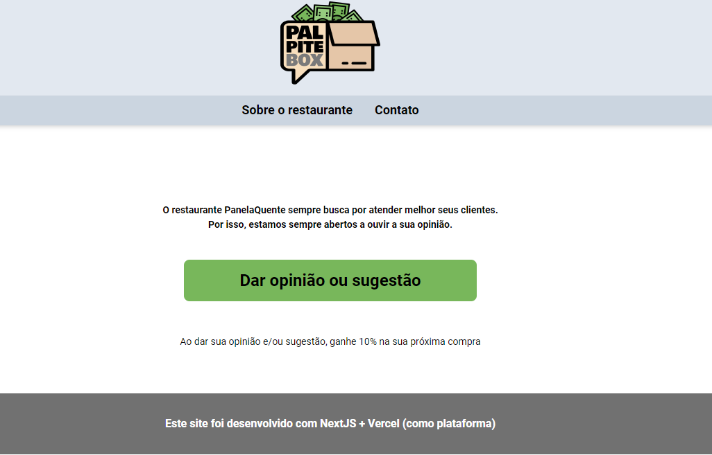

# Palpite Box
[](http://hits.dwyl.com/EduCintraBR/EduCintraBR/palpitebox)

Palpite Box é uma aplicação feita com NextJS na semana Fullstack Master da DevPleno



## Getting Started

Siga os passos abaixo para rodar esta aplicação direto na sua máquina.

### Pré-requisitos

Possuir NodeJS e Npm instalados em sua máquina e possuir uma conta Google.

```
npm run dev
```
Dê uma olhada no arquivo .env.example para saber quais variáveis de ambiente são necessárias preencher, para 
conseguir estas variáveis acesse [Google Console](https://console.developers.google.com), procure por SHEETS API,
cadastre e baixe uma chave de acesso, é nessa chave que você encontrará o que colocar no arquivo .env.example.

## Deploy da aplicação

O deploy deste projeto foi feito utilizando a [Vercel](https://vercel.com/) (sem configuração extra).

## Construído com

* [NextJs](https://nextjs.org/) - The react framework.
* [TailwindCSS](https://tailwindcss.com/) - A utility-first CSS framework for rapidly building custom designs.
* [PurgeCSS](https://purgecss.com/) - A tool to remove unused CSS.

## Autores

* **Eduardo Cintra** - [LinkedIn](https://www.linkedin.com/in/educintrabr/)

## License

Este projeto está sobre a licença MIT License - veja o arquivo [LICENSE.md](LICENSE.md) para mais detalhes.

## Agradecimentos

* Este projeto foi feito durante as aulas da Semana Fullstack Master da [Devpleno](https://devpleno.com).
